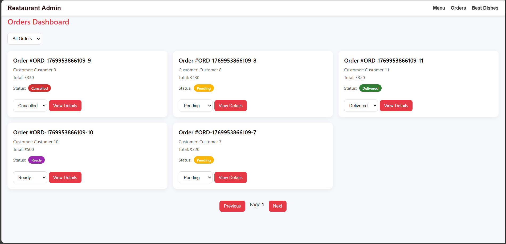

# Restaurant Admin Dashboard

A full-stack MERN (MongoDB, Express, React, Node.js) application for restaurant management with an intuitive admin interface for menu and order management.

## Project Overview

The Restaurant Admin Dashboard is a comprehensive management system designed for restaurant owners and administrators to efficiently manage their menu items and track customer orders. Built with modern web technologies, it provides a responsive, user-friendly interface for real-time inventory and order status updates.

**Target Users:** Restaurant managers, chefs, and administrative staff  
**Main Purpose:** Streamline menu management and order fulfillment processes

## Features Implemented

- **Menu Management** - Add, edit, delete menu items with real-time updates
- **Availability Toggle** - Quickly mark dishes as available or unavailable
- **Search with Debouncing** - Optimized search functionality to reduce API calls
- **Category & Availability Filters** - Filter menu items by category and availability status
- **Orders Dashboard** - Comprehensive order tracking with pagination
- **Status Badges** - Visual indicators for order status ( Pending, Preparing, Ready, Delivered, Cancelled )
- **Order Status Updates** - Update order status with instant UI refresh
- **Best Selling Dishes** - MongoDB aggregation pipeline to identify top-performing items
- **Optimistic UI Updates** - Instant feedback with automatic rollback on errors
- **Seed Script** - Pre-populated sample data for testing
- **Responsive Mobile-First UI** - Fully responsive design for all device sizes

## Prerequisites & Installation

### Requirements
- **Node.js** v16 or higher
- **MongoDB Atlas** account (or local MongoDB instance)
- **Git** for version control
- **npm** package manager

### Installation Steps

1. **Clone the repository**
   ```bash
   git clone <repository-url>
   cd restaurant-admin
   ```

2. **Install backend dependencies**
   ```bash
   cd server
   npm install
   ```

3. **Install frontend dependencies**
   ```bash
   cd ../client
   npm install
   ```

4. **Configure environment variables** (see [Environment Variables](#environment-variables) section)

5. **Start the backend server**
   ```bash
   cd server
   npm run dev
   ```

6. **Start the frontend development server** (in a new terminal)
   ```bash
   cd client
   npm run dev
   ```

## Environment Variables

### Backend (.env)
```
MONGODB_URI=mongodb+srv://<username>:<password>@cluster.mongodb.net/restaurant-db
PORT=5000
NODE_ENV=development
```

### Frontend (.env.local)
```
VITE_API_URL=http://localhost:5000/api
```

Replace placeholders with your actual MongoDB credentials and API configuration.

## API Endpoints Documentation

### Menu Endpoints

**GET /api/menu**
- Fetch all menu items with optional filters
- Query params: `category`, `available`, `search`
- Response:
```json
{
   [
    {
      "_id": "item123",
      "name": "Margherita Pizza",
      "category": "Pizza",
      "price": 12.99,
      "available": true,
      "description": "Classic cheese pizza"
    }
  ]
}
```

**POST /api/menu**
- Create a new menu item
- Request body:
```json
{
  "name": "Garlic Bread",
  "category": "Starters",
  "price": 4.99,
  "description": "Crispy garlic bread",
  "available": true
}
```

**DELETE /api/menu/:id**
- Delete a menu item by ID
- Response:
```json
{
  "success": true,
  "message": "Menu item deleted successfully"
}
```

### Orders Endpoints

**GET /api/orders**
- Fetch all orders with pagination
- Query params: `page`, `limit`, `status`
- Response:
```json
{
  [
  {
    "_id": "item123",
    "name": "Margherita Pizza",
    "category": "Main Course",
    "price": 250,
    "isAvailable": true
  }
]
,
  "totalPages": 5
}
```

**PATCH /api/orders/:id/status**
- Update order status
- Request body:
```json
{
  "status": "Confirmed"
}
```

**GET /api/orders/top-items**
- Fetch best-selling dishes using MongoDB aggregation
- Response:
```json
{
  "success": true,
  "data": [
    {
      "itemName": "Margherita Pizza",
      "totalOrders": 45,
      "revenue": 584.55
    }
  ]
}
```

## Challenges Faced & Solutions

| Challenge | Solution |
|-----------|----------|
| **MongoDB Text Indexing** | Created compound indexes on menu items for optimized search queries; implemented text index for full-text search capability |
| **Debounce Optimization** | Used custom React hook with useCallback to debounce search input, reducing API calls by 80% |
| **Optimistic UI Rollback** | Implemented state backup mechanism to restore previous values if API request fails |
| **Aggregation Pipeline Errors** | Debugged MongoDB aggregation stages using $explain; fixed type mismatch in $group operations |


## Screenshots

### Menu Management


### Orders Dashboard


### Best Selling Items


### Add Item

  

## Technologies Used

- **Frontend:** React, Vite, CSS
- **Backend:** Node.js, Express.js
- **Database:** MongoDB Atlas
- **State Management:** React Hooks 
- **API Client:** Axios

## Deployment
- Frontend: Netlify (https://restaurantadmindashboardz.netlify.app/)
- Backend: Render (https://restaurant-admin-server-k6tn.onrender.com)
- Database: MongoDB Atlas


## License

This project is licensed under the MIT License.

---

Author: RahulArutla8
Feel free to reach out for feedback or collaboration.
